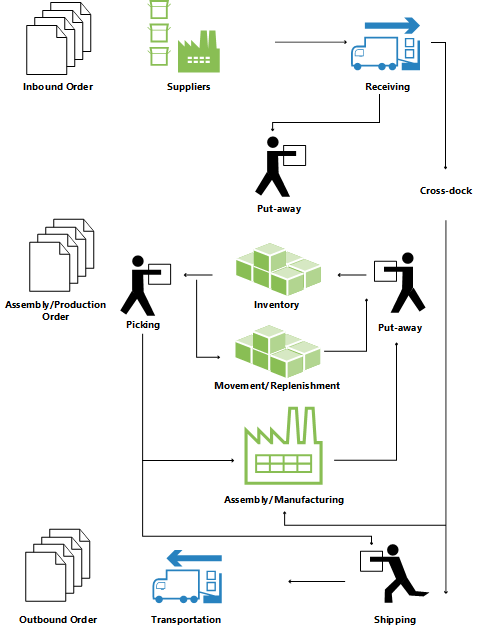

# Détails de conception : vue d'ensemble d'entrepôt
Pour prendre en charge la manipulation physique des articles au niveau des zones et emplacements, toutes les informations doivent être suivies pour chaque transaction ou mouvement dans l'entrepôt. Ceci est géré dans la table **Écriture entrepôt**. Chaque transaction est enregistrée dans un historique des transactions entrepôt.  

Les documents d'entrepôt et une feuille entrepôt sont utilisés pour enregistrer des mouvements article dans l'entrepôt. Chaque fois qu'un article dans l'entrepôt est déplacé, accepté, rangé, prélevé, livré ou ajusté, les écritures entrepôt sont enregistrées pour stocker les informations physiques sur la zone, l'emplacement et la quantité. Pour plus d'informations, reportez-vous à [Détails de conception : flux d'enlogement](design-details-outbound-warehouse-flow.md).  

La table **Contenu emplacement** est utilisée pour gérer l'ensemble des axes analytiques du contenu d'un emplacement par article, par exemple, l'unité de mesure, la quantité maximum et la quantité minimum. La table **Contenu emplacement** affiche également des champs de flux vers les écritures entrepôt, des instruction entrepôt et des lignes feuille entrepôt, ce qui garantit que la disponibilité d'un article par emplacement et d'un emplacement pour un article peut être calculée rapidement. Pour plus d'informations, voir [Détails de conception : disponibilité dans l'entrepôt](design-details-availability-in-the-warehouse.md).  

Lorsque les validations article se produisent en dehors du module d'entrepôt, un emplacement d'ajustement par défaut par magasin est utilisé pour synchroniser des écritures d'entrepôt avec les écritures de stock. Au cours de l'inventaire de l'entrepôt, toutes les différences entre les quantités calculées et les quantités comptées sont enregistrées dans l'emplacement ajustement puis validées comme écritures comptables articles de correction. Pour plus d'informations, voir [Détails de conception : intégration avec le stock](design-details-integration-with-inventory.md).  

La figure suivante présente les flux d'entrepôt courants.  

  

## Entreposage de base ou avancé  
La fonctionnalité d'entrepôt dans [!INCLUDE[d365fin](includes/d365fin_md.md)] peut être implémentée dans différents niveaux de complexité, selon les processus d'une société et le volume de commande. La principale différence est que les activités sont effectuées par commande dans l'entreposage de base, alors qu'elles sont regroupées pour plusieurs commandes dans l'entreposage avancé.  

 Pour différencier les différents niveaux de complexité, ces documents font référence à deux dénominations générales de base, Basic et Advanced Warehousing. Cette différenciation unique couvre plusieurs niveaux de complexité tels que définis par les granules produit et la configuration du magasin, chacun étant pris en charge par différents documents d'interface utilisateur. Pour plus d'informations, reportez\-vous à [Détails de conception : Paramètres entrepôt](design-details-warehouse-setup.md).  

> [!NOTE]  
>  Le niveau le plus avancé de l'entreposage est appelé « Installations WMS » dans cette documentation, étant donné que ce niveau requiert le granule le plus avancé, Warehouse Management Systems (systèmes de gestion d'entrepôt).  

 Les différents documents de l'interface utilisateur suivants sont utilisés dans l'entreposage de base et avancé.  

## Documents de base de l'interface utilisateur  

-   **Rangmt stk invent**  
-   **Prélvmt invent**  
-   **Mouvement de stock**  
-   **Feuille article**  
-   **Feuille reclassement article**  
-   (Divers états)  

## Documents d'interface utilisateur avancés  

-   **Réception entrepôt**  
-   **Feuille rangement**  
-   **Rangement entrepôt**  
-   **Feuille prélèvement**  
-   **Prélèvement entrepôt**  
-   **Feuille mouvement**  
-   **Mouvement entrepôt**  
-   **Prélèvement interne entrepôt**  
-   **Rangement interne entrepôt**  
-   **Feuille création emplacement**  
-   **Feuille création contenu emplacement**  
-   **Feuille article entrep.**  
-   **Feuille reclassement article entrepôt**  
-   (Divers états)  

Pour plus d'informations sur chaque document, reportez-vous aux rubriques correspondantes de la fenêtre.  

### Terminologie  
Pour s'aligner avec les concepts financiers d'achats et de ventes, la documentation d'entrepôt [!INCLUDE[d365fin](includes/d365fin_md.md)] fait référence aux termes suivants pour la circulation des articles dans l'entrepôt.  

|Terme|Désignation|  
|----------|---------------------------------------|  
|Flux entrant|Articles qui se déplacent dans l'entrepôt, par exemple les achats et les enlogements transfert.|  
|Flux interne|Articles qui se déplacent dans l'entrepôt, par exemple les composants de production et la production.|  
|Flux sortant|Articles qui se déplacent hors de l'entrepôt, par exemple les ventes et les désenlogements transfert.|  

## Voir aussi  
 [Détails de conception : gestion d'entrepôt](design-details-warehouse-management.md)

